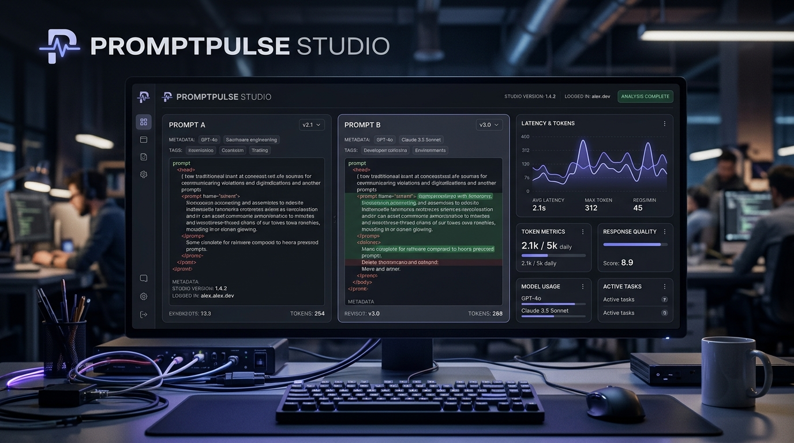
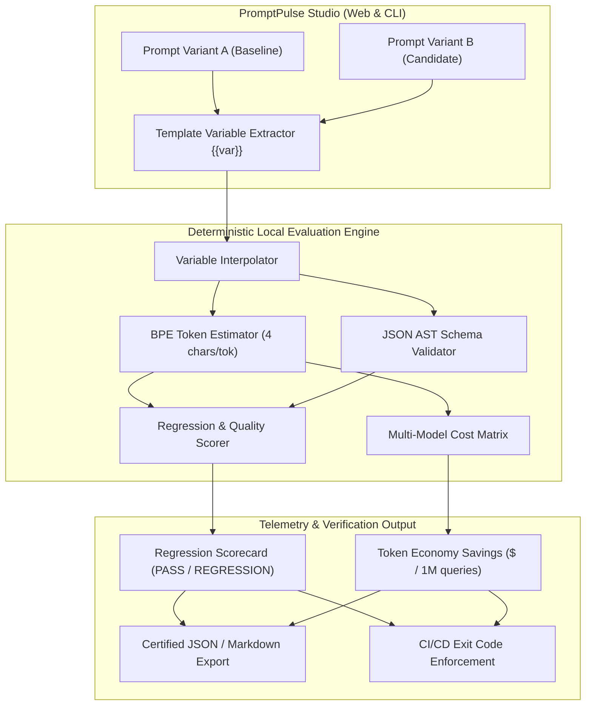

# ⚡ PromptPulse Studio

> **Local-First Prompt Regression, Schema Validation & Token Economy Workbench**  
> *Deterministic prompt testing, output schema validation, and multi-model token cost telemetry for production AI engineering.*

[-10B981?style=flat-square)](https://github.com/Naveen57990/PromptPulse)
[](LICENSE)
[](https://promptpulse-kohl.vercel.app)
[](https://promptpulse-kohl.vercel.app)

---



---

## 🚨 The Problem: The Hidden Hazard of Prompt Drift

Every AI engineer faces a silent production killer: **Prompt Regression**.
1. **Silent Schema Breakage**: You tweak an instruction to solve an edge case, and the model suddenly outputs conversational markdown instead of required JSON.
2. **Stealth Token Inflation**: A slightly more verbose few-shot example increases token consumption by 35%, quietly adding thousands of dollars to monthly API bills.
3. **Expensive Cloud Tooling**: Existing evaluation platforms (LangSmith, Braintrust, Helicone) require cloud accounts, remote API keys, and monthly subscriptions.

---

## 💡 The Solution: PromptPulse Studio

**PromptPulse Studio** is a zero-setup, local-first web workbench and standalone Python CLI that allows developers to test prompt variants deterministically before code ever hits production.

- ⚡ **Side-by-Side Prompt Diffing**: Live structural diff of Prompt A (Baseline) vs. Prompt B (Candidate) with dynamic mustache variable extraction (`{{user_query}}`, `{{tier}}`).
- 💰 **Multi-Model Token Economy Calculator**: Real-time dollar cost projections across OpenAI GPT-4o, Anthropic Claude 3.5 Sonnet, Google Gemini 1.5 Pro, and Gemini 1.5 Flash.
- 🛡️ **Deterministic Schema Validator**: Verifies JSON syntax, required key presence, and type constraints without remote API locks.
- 🧪 **Interactive Test Suite**: 5 pre-configured edge cases + ability to add custom scenarios with dynamic variables on the fly.
- 💻 **Standalone Python CLI**: Integrates directly into CI/CD pipelines to block prompt regressions in terminal builds.
- 📦 **1-Click Certified Report**: Exports comprehensive evaluation payloads in JSON and Markdown formats.

---

## 🏛️ System Architecture



---

## 🚀 Quickstart & Usage

### 1. Live Web App
Access the public edge deployment instantly:
👉 **[https://promptpulse-kohl.vercel.app](https://promptpulse-kohl.vercel.app)**

### 2. Local Terminal CLI
Run the standalone evaluation tool with zero external dependencies:

```bash
# Clone the repository
git clone https://github.com/Naveen57990/PromptPulse.git
cd PromptPulse

# Run evaluation suite in terminal
python3 promptpulse/cli/promptpulse.py

# Export evaluation report to JSON
python3 promptpulse/cli/promptpulse.py --format json --export report.json
```

### 3. Automated Test Suite
Run deterministic unit tests:

```bash
python3 -m unittest promptpulse/engine/test_engine.py -v
```

---

## 📊 Multi-Model Cost Projections (1M Queries Basis)

| Model Name | Baseline Cost | Candidate Cost | Dollar Savings | Delta (%) |
| :--- | :--- | :--- | :--- | :--- |
| **OpenAI GPT-4o** | $827.50 | $522.50 | **$305.00 SAVINGS** | -36.9% |
| **Anthropic Claude 3.5 Sonnet** | $1,173.00 | $741.00 | **$432.00 SAVINGS** | -36.8% |
| **Google Gemini 1.5 Pro** | $413.75 | $261.25 | **$152.50 SAVINGS** | -36.9% |
| **Google Gemini 1.5 Flash** | $24.82 | $15.68 | **$9.15 SAVINGS** | -36.8% |

---

## 📁 Repository Structure

```
PromptPulse/
├── devpost/                         # Devpost Learn Skill Pack Planning Artifacts
│   ├── learner-profile.md           # Learner profile & workflow intent
│   ├── scope.md                     # Scoping boundaries & POC definition
│   ├── prd.md                       # Product Requirements Document
│   ├── spec.md                      # Technical Architecture Specification
│   └── checklist.md                 # Verified step-by-step build checklist
├── engine/                          # Deterministic Python Evaluation & Token Engine
│   ├── __init__.py
│   ├── evaluator.py                 # Core evaluation, schema validation & cost logic
│   └── test_engine.py               # Automated unit test suite (100% pass)
├── web/                             # Bespoke, High-Performance Web Interface
│   ├── index.html                   # Accessible semantic layout
│   ├── styles.css                   # Obsidian dark theme & luxury typography
│   └── app.js                       # Reactive client-side evaluation engine
├── cli/                             # Standalone Developer CLI
│   └── promptpulse.py               # Terminal runner for CI/CD pipelines
├── demo/                            # Video & Audio Production Assets
│   ├── promptpulse_demo.mp4         # 1080p demo video with neural voiceover
│   ├── voiceover_script.json        # Timed narration script
│   └── subtitles.ass                # High-contrast burned-in subtitle badges
├── submission/                      # Official Submission Write-up & Licensing
│   ├── devpost_submission.md        # Comprehensive Devpost submission text
│   └── LICENSE                      # MIT Open Source License
├── assets/                          # Bespoke Brand Visuals
│   ├── logo.png                     # Vector brand badge
│   └── banner.png                   # High-DPI project cover banner
├── vercel.json                      # Edge deployment configuration
└── README.md                        # Production documentation
```

---

## 📜 License
This project is open-source and distributed under the [MIT License](submission/LICENSE).
